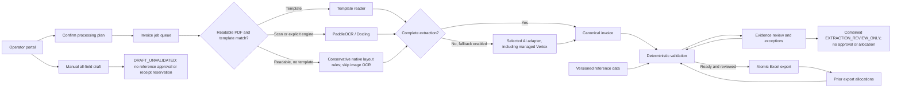

# Invoice first. A supplier platform next.

**Decision document • 5 October 2026 • Local MVP, hosted pilot and proposed production roadmap**

## The decision

Build the invoice control, matching and review product in house. Reuse maintained document readers instead of training a new OCR model first. Keep AI replaceable. The lasting product value is knowing which supplier, site, company, item, purchase order and receipt a document belongs to, and showing why a proposed Excel row is safe to produce.

The first release removes rekeying where evidence is available. It does not remove the need for a person to resolve missing or contradictory evidence. A complete-looking answer from AI is not proof that goods were received or that a supplier is approved.

## A normal day in the new process

An accounts-payable operator selects a batch of invoices. The portal shows the reference version, reader, fallback provider and price/total rules. The operator confirms those choices once for the batch. Each file gets its own job and visible stage, so a poor scan does not hide the progress of other invoices. A readable PDF first uses its native text; when no supplier template matches, conservative layout rules look only for explicit invoice labels and spatial table columns. A strong invoice heading is required, purchase orders are rejected, ambiguous values stay empty and internal business codes are never inferred. The automatic path then skips the expensive image-OCR pass and can use the permitted AI fallback.

The readers propose invoice fields and lines. The application uses a known PO to fill missing internal identifiers only when that PO has one unambiguous record. It records the source of each derived value. It matches item identifiers within the supplier site, checks prices and units, and compares quantities with accepted receipts after returns and previous allocations.

The operator sees the document, extracted fields, current stage, reader trace and reasons for any hold. Up to two files process at once; the rest remain queued. **Select processed** supports invoice-by-invoice review, and visible unsaved changes must be saved before opening another invoice or downloading a batch. Selected saved records can become one `EXTRACTION_REVIEW_ONLY` workbook without approval or allocation. Selected ready invoices use the separate approved path: transaction IDs are shared across all three sheets, and export plus quantity allocation happen in one database transaction.

When the business needs a file before OCR or reference approval finishes, a separate manual editor exposes every target column. It downloads one transaction as `DRAFT_UNVALIDATED` only after an explicit acknowledgement. The workbook and audit record say that references were not validated and no receipt was reserved. It neither changes the extraction job nor enters the approved-export ledger.

Large source extracts feed a separate read-only evidence lookup. Its atomic cutover completed with 412,139 live rows: 114,940 item rows and 297,199 PO/GRN rows, plus a sanitized archive receipt beginning `d06678`. Ninety-four guard probes remained healthy through the deployments; final state read took 1.917 seconds and database disk use was 5.244 GB of 10.464 GB. Authenticated API QA returned the expected rank-one exact-name candidate in 2.831 seconds, rank-one typo candidate in 1.182 seconds and PO result in 0.462 seconds; an impossible strict filter returned no result and confirmation flags remained set. The final References UI check showed the exact source counts, rank-one exact and typo candidates in 1.222 and 1.293 seconds, three exact PO results in 0.446 seconds, provenance/confirmation warnings, zero mutations and zero page errors. Exact identifiers and fuzzy product-name candidates retain source and conflict context. Price, quantity and unit can help rank candidates; a person must inspect and confirm the evidence. Lookup evidence never becomes approved matching data by itself.

## What has been built

| Capability | Current delivery | Next gate |
|---|---|---|
| Multiple invoice files | Local and hosted portal, guarded processing, queue and editable review | Representative supplier-format evaluation |
| Document reading | invoice2data, conservative native layout rules, PaddleOCR and Docling installed and exercised | Frozen held-out accuracy evaluation by supplier, scan quality, language and length |
| Readable-PDF path | Native text can bypass image OCR; invoice headings, explicit labels and spatial columns are required | Expand rules only from adjudicated failures; do not infer internal codes or ambiguous facts |
| AI fallback | Managed Vertex AI plus OpenAI, Anthropic, ChatGPT and restricted Claude adapters; strict schema and failure handling; saved versus verified access is explicit | Complete the private held-out evaluation and measure corrections, latency and cost |
| Matching | Deterministic supplier/site/route/PO/item/receipt/tax rules | Data-owner-approved reference snapshot |
| Excel | Exact approved three-sheet output plus hosted-verified combined review and all-field manual draft paths | Downstream business acceptance of each visible boundary |
| Business references | Canonical import plus 412,139 live private evidence rows; authenticated API and UI search verified | Approve mapping, receipt-status and prior-invoicing semantics separately |
| Owner connections | Hosted model loading and invalid-key handling verified; Claude and ChatGPT transfer adapters implemented | Replace the rejected Anthropic key; verify live owner subscription access and inference |
| Invoice deletion | Hosted confirmed deletion verified; live evidence removed with minimal approved-ledger tombstones retained | Agree provider backup/version retention and operational ownership |
| Restricted cloud pilot | Firebase sign-in, Cloud Run, Cloud SQL, private evidence storage and managed secrets | Business acceptance and operational hardening |
| Shared enterprise service | Design below | Role separation, durable workers, operational controls and load testing |

## Architecture

The browser presents the workflow. FastAPI owns validation and export; no browser-side approval can bypass server rules. Local mode uses SQLite. The hosted pilot uses Cloud SQL PostgreSQL for jobs, encrypted credentials, reference snapshots, audit events and the export ledger, with private Cloud Storage for sources and templates. Reader subprocesses have time limits and receive no application API keys. AI adapters receive only the invoice or extracted text required for reading, not the entire master-data database.

The hosted pilot verifies Firebase identity and an explicit owner allowlist, and uses Secret Manager for runtime secrets. Managed Vertex AI uses Application Default Credentials for the workspace service identity, a configured owner project/region and the fixed Google API endpoint; usage is charged to that project and its output returns through the same schema, validation and review gates. A saved provider key means only that an encrypted credential exists. Model retrieval or an explicit probe verifies access. If no connected model is selected, the UI may offer one from a connected provider; it never replaces a user's still-connected selection. Claude setup tokens are encrypted application credentials and are passed only to a restricted server-side CLI invocation. ChatGPT transfer removes the local encrypted credentials before hosted import. Final revision `inv-studio-api-00009-vxw` has 100% traffic and uses the tested core image plus the cancel/footer fixes. Paddle, managed AI, authenticated API/browser lookup, deletion/model controls and cancel-dialog behavior passed. The allowlist is owner-only, the owner account remained email-verified, anonymous/direct-service API requests returned 401 and the temporary identity was deleted.

For a shared production service, retain these contracts and add role-based access, normalized reference staging, a durable message queue, leased CPU/GPU workers, schema migrations and operational monitoring. The current queue and processing plans remain in memory; drain work before replacing a revision. A relational transaction reserves receipt quantities and records the approved export exactly once. Keep document extraction and unvalidated draft creation outside that transaction. See the cloud runbook for recovery boundaries.

## Why these components

| Component | Job | Limitation and decision |
|---|---|---|
| invoice2data | Repeatable supplier templates and native text extraction | Best when layout is known; templates require maintenance. On scans, Paddle may supply image text and the trace names that input rather than attributing pixel reading to invoice2data. |
| PaddleOCR | Read image words and coordinates for conservative layout conversion | Three scans recovered every line and tested numeric/identifier fact, but descriptions remain unproven; the conservative all-field floor is 90.91%. |
| Docling | Convert native document layout and tables into invoice lines | Bounded native examples worked. Measured OCR cells yielded only 10/23 lines on a challenging two-page scan and poor source-position matches; a ten-page timeout remains. Do not present it as a universal fallback. |
| Managed Vertex / selected AI | Recover unfamiliar layouts and propose structured fields | Model output is untrusted data. Require schema validation, exact reference matching and review; record provider/model, latency, token usage and project cost. |
| Custom validation service | Supplier/site scope, item identity, receipts, rules and duplicate control | This is business logic that generic OCR cannot supply. Build and own it. |
| Source evidence lookup | Search large item and PO extracts without treating them as master approval | Show conflicts and provenance, then require explicit confirmation; canonical approval remains separate. |
| Custom Excel renderer | Preserve the receiving workbook contract | Generate typed cells from validated records or an explicitly labelled manual draft; do not let AI write arbitrary workbook formulas. |

The local engines are alternatives in an ordered pipeline, not three votes on truth. The application keeps one reader's candidate rather than silently combining conflicting values. Native layout rules require explicit visible evidence, preserve printed line net/tax separately from printed unit price, preserve printed buyer name separately from the internal buyer/company code, leave conflicts and ambiguous dates unset, and never derive header totals or internal codes from arithmetic. A completeness score is read coverage, not a calibrated probability of correctness. The trace reports a true engine failure separately from a completed text-only attempt with zero structured items.

Audit outcomes use `text_read`, `fields_extracted` and `extraction_failed`. The older `extracted` event is displayed only as “Reader run finished (legacy event)” because it does not prove that structured fields were produced. Permanent invoice deletion requires explicit confirmation and current revisions. It removes live jobs, source objects, detailed audit evidence and workbook copies. Approved invoices retain only the invoice key and PO-line quantity allocations required for duplicate/receipt protection, plus a minimal deletion audit; provider backups, logs, object versions and soft-deleted copies remain subject to provider retention.

## Supplier and company model for the wider product

A supplier legal entity is separate from its operational sites. An approved route connects a supplier site, buying legal entity, ship-from market, delivery market and invoice currency. A UAE supplier invoicing in AED for Kuwait delivery is therefore a different route from domestic UAE supply, even when the seller and currency are unchanged. An existing supplier name alone does not authorize that route.

Items have internal identities, supplier-specific codes, GTINs, packaging and units. Digital-channel content should be versioned separately from purchasing identity: titles, translations, images, ingredients, attributes and channel requirements can change without changing the invoice matching key. Item discovery and fuzzy similarity can propose a match; a steward must approve an ambiguous identifier or unit conversion.

For a new store in an existing market, search approved routes and assortment coverage first. For a new market, generate a discovery and qualification case: candidate suppliers, local entity/site checks, delivery capability, documentation and commercial review. Reuse verified facts with expiry dates and provenance; do not repeat every task or assume an approval transfers across markets. AI can assemble a shortlist and highlight gaps; procurement owns approval.

## Proposed 24-flow product map

These are proposed coverage areas, not a claim that all earlier source processes have been implemented or independently verified.

| Discover and approve | Prepare and buy | Receive and pay | Improve and govern |
|---|---|---|---|
| 1. Store/market demand | 7. Supplier item intake | 13. Delivery evidence | 19. Supplier performance |
| 2. Existing coverage search | 8. Item identity resolution | 14. Receipt acceptance/returns | 20. Expiring document renewal |
| 3. Candidate discovery | 9. Packaging/unit approval | 15. Invoice capture | 21. Reference stewardship |
| 4. Legal entity/site onboarding | 10. Digital content enrichment | 16. PO/item/receipt matching | 22. Exception analytics |
| 5. Market/route qualification | 11. Quote/price agreement | 17. Dispute resolution | 23. Access/audit management |
| 6. Approval/renewal | 12. PO creation/change | 18. Excel/export/payment handoff | 24. Rule and model evaluation |

## Delivery plan and people

The estimates below are planning ranges, not measured delivery commitments. They assume reference owners are available and the first production scope stays with one invoice, one PO, one currency and one tax treatment per file.

| Stage | Outcome and exit evidence | Indicative duration |
|---|---|---|
| Current release | Real UI, visible stages, lookup, draft and connection-transfer paths | Integrated suite and hosted reader/lookup/control checks passed |
| Hosted pilot | Three-reader and exact-batch synthetic workflow; persisted evidence recovered after instance replacement; native 193-row, Paddle 96/99, managed-AI 97/99, two-real-invoice review-workbook, lookup, deletion/model and cancel-dialog checks passed | Final revision `00009-vxw` live; owner-only allowlist and unauthenticated-denial cleanup passed |
| Data contract pilot | Full source profiles, explicit mappings, approved missing values, target workbook accepted | 1–2 weeks |
| Supplier evaluation | At least 100 representative invoices across priority suppliers/languages; adjudicated field and line truth | 2–3 weeks |
| Production pilot | Roles, durable queue, backups, monitoring, controlled UAT and measured savings | 3–5 weeks |
| Supplier platform expansion | Discovery, route onboarding, item intake and channel-content workflows | Scope and estimate after invoice pilot |

A practical pilot team is one product/process owner, one AP expert, a reference-data steward, two engineers, and part-time QA/platform support. AI/ML expertise helps with evaluation and difficult layouts; a bespoke model-training team is not the initial dependency. These roles may overlap, but the people who approve reference meanings must be named.

Size using measured pages and latency: required worker-hours = documents × average processing seconds ÷ 3,600. Add headroom for retries and model download/startup. AI cost = fallback documents × measured average input/output token cost. Keep an explicit monthly cap and record fallback share, tokens and latency. No universal accuracy or cost claim is made before the representative evaluation.

Private measurements establish bounded behavior, not population-wide quality. Native PDF table extraction with AI off recovered 570/570 lines and 3,990/3,990 tested line facts across 15 PDFs from one layout family; the first batch took 24.6 seconds total and a warm batch 12.9 seconds total. A separate hosted native check recovered 193/193 rows, 6/6 headers and 1,351/1,351 line facts in 10.21 seconds. Paddle recovered 6/6 adjudicated scan lines and 60/60 tested header/identifier/numeric facts, while description accuracy remains unproven; the conservative 60/66 floor is 90.91%. On a separate challenging two-page scan, the 80.755-second local baseline recovered 23/23 rows, 6/7 headers and 90/99 checked facts (90.9%). Its bounded 86.542-second higher-resolution alternate met every selection gate and improved the whole result to 96/99 (97.0%): 21/23 SKUs and 23/23 quantities, prices and printed net amounts, while the absent PO stayed null. Combined local reader time was about 168 seconds and peak cgroup memory was 2.31 GiB. Revision `00007` took 134.082 seconds for the hosted baseline and correctly retained 90/99 under its 100-second eligibility gate and 240-second Paddle budget. Revision `00008` is live and makes the alternate eligible only when a baseline PDF has at most two pages, finishes within 150 seconds and is missing quantity or price. Paddle receives up to 360 seconds total and the alternate receives the exact remaining budget; Docling stays at 240 seconds. Its hosted Paddle run completed the adaptive path in 242.98 seconds and returned 23/23 rows and 96/99 checked facts (97.0%). The alternate replaces the baseline only if row count and invoice number/date/PO/currency/net/tax do not regress, missing quantity/price improves and printed net reconciles. The three earlier scans did not trigger it and retained their baseline results. Heavy local OCR work is serialized to fit the memory envelope while native/AI work can continue; an early alternate failure keeps the baseline. A separate hosted managed-AI check returned 23 rows and 97/99 checked facts in 16.18 seconds, preserved printed buyer name and left the internal buyer code null. Docling recovered 5/5, 1/1 and 17/17 native lines in bounded examples; on that challenging two-page scan, 278 measured OCR cells produced only 10/23 rows and position-exact source comparison found 0 SKUs, 1 quantity and 2 prices. A ten-page run exceeded 528 seconds. The earlier managed-AI corpus returned all source-tested fields exactly across 15 documents and 570 lines from one layout family. These cohorts cannot prove the expected 95% across suppliers, scans, languages and lengths.

Managed Vertex used 36,450 input tokens and 91,892 output tokens including reasoning across 15 successful calls. At the current global introductory Gemini 3.7 Flash rates through 31 December 2026, calculated model usage is USD 0.3719325, or USD 24.7955 per 1,000 documents at the same mix. This is not an actual bill and excludes retries and infrastructure. See [Google's Agent Platform pricing](https://cloud.google.com/gemini-enterprise-agent-platform/generative-ai/pricing).

## How the proposed 90% target will be evaluated

Freeze a gold set before tuning. A reviewer transcribes every expected header field and line cell, a second reviewer checks it against the source, and disagreements are adjudicated. Include expected missing values as explicit `null`, then hold the set out from template, prompt and model changes. Stratify results by supplier, native text versus scan, language, page-count band and document quality; preserve enough cases in each agreed stratum to expose a weak subgroup.

Report three measures separately:

1. **Header-field exact accuracy:** correct header cells divided by all gold header cells, including expected-null cells. Apply only contract-defined normalization such as ISO dates, Decimal representation and whitespace; do not use fuzzy credit for the wrong identifier.
2. **Line extraction accuracy:** first align predicted and gold lines by adjudicated document order/evidence, then report line recall and exact cell accuracy across item identifiers, description, quantity, unit, price and evidence page. Missing, extra and misaligned lines count as errors.
3. **Zero-correction invoice rate:** invoices for which the reviewer changes no extracted header or line value divided by every attempted invoice.

Errors, timeouts, rejected schemas and empty outputs remain in every denominator and score zero for the affected invoice. Arithmetic reconciliation, schema validity and completeness are reported as diagnostics, not accuracy. The proposed pilot gate is at least **90% header-field exact accuracy, 90% line-cell exact accuracy and 90% zero-correction invoices**, with zero false-ready approved invoices. Each agreed supplier/language/scan stratum must also meet the owner-set minimum before release; an aggregate score cannot hide a failing subgroup. Record confidence intervals, correction reasons, provider/model/revision, latency, tokens and cost. A controlled reviewer signs the frozen comparison and finance/data owners decide whether failures require rule changes, supplier-specific templates or continued manual handling. These are acceptance targets, not achieved results.

## Decisions to settle during the pilot

1. Which source field proves receipt acceptance, and which represents cumulative already-invoiced quantity outside this application?
2. Which entity owns each buying company, supplier site, market route and tax rule?
3. Which invoice formats, languages and edge cases are in the initial business acceptance set?
4. Which provider/account may receive invoice content, and what retention and budget settings apply?
5. Who signs off the generated workbook against the receiving process?

These are business-data decisions. They do not prevent local reading or a synthetic demonstration; they prevent claiming that a real invoice is ready when evidence is absent.

## Source references

Implementation choices should be rechecked when dependencies or provider interfaces change. Primary sources used for this build:

- [invoice2data code and templates](https://github.com/invoice-x/invoice2data).
- [PaddleOCR code and model documentation](https://github.com/PaddlePaddle/PaddleOCR).
- [Docling code and supported conversion workflow](https://github.com/docling-project/docling).
- [Vertex AI Gemini model guide](https://docs.cloud.google.com/gemini-enterprise-agent-platform/models/guides/gemini-3-7-flash), [structured output](https://docs.cloud.google.com/gemini-enterprise-agent-platform/models/capabilities/control-generated-output) and [Application Default Credentials](https://docs.cloud.google.com/docs/authentication/application-default-credentials).
- [OpenAI structured outputs](https://developers.openai.com/api/docs/guides/structured-outputs) and [file inputs](https://developers.openai.com/api/docs/guides/file-inputs).
- [Official ChatGPT token sharing for open-source/local applications](https://developers.openai.com/siwc/token-sharing-open-source).
- [Anthropic structured outputs](https://platform.claude.com/docs/en/build-with-claude/structured-outputs) and [PDF support](https://platform.claude.com/docs/en/build-with-claude/pdf-support).
- [Claude CLI reference](https://code.claude.com/docs/en/cli-reference) and [Claude-plan SDK policy](https://support.claude.com/en/articles/15036540-use-the-claude-agent-sdk-with-your-claude-plan). Account availability and provider policy must be checked at connection time.
