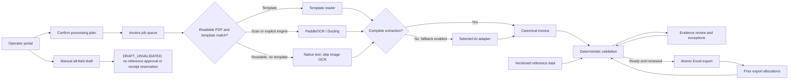

# Invoice first. A supplier platform next.

**Decision document • 4 October 2026 • Local MVP, hosted pilot and proposed production roadmap**

## The decision

Build the invoice control, matching and review product in house. Reuse maintained document readers instead of training a new OCR model first. Keep AI replaceable. The lasting product value is knowing which supplier, site, company, item, purchase order and receipt a document belongs to, and showing why a proposed Excel row is safe to produce.

The first release removes rekeying where evidence is available. It does not remove the need for a person to resolve missing or contradictory evidence. A complete-looking answer from AI is not proof that goods were received or that a supplier is approved.

## A normal day in the new process

An accounts-payable operator selects a batch of invoices. The portal shows the reference version, reader, fallback provider and price/total rules. The operator confirms those choices once for the batch. Each file gets its own job and visible stage, so a poor scan does not hide the progress of other invoices. A readable PDF first uses its native text; when no supplier template matches, the automatic path skips the expensive image-OCR pass and can use the permitted AI fallback.

The readers propose invoice fields and lines. The application uses a known PO to fill missing internal identifiers only when that PO has one unambiguous record. It records the source of each derived value. It matches item identifiers within the supplier site, checks prices and units, and compares quantities with accepted receipts after returns and previous allocations.

The operator sees the document, extracted fields, current stage, reader trace and reasons for any hold. After correction and evidence review, the application validates again. Selected ready invoices become one Excel workbook. Invoice 1 has transaction number 1 in Header, Tax_Breakdown and Details; invoice 2 has transaction number 2 throughout. Export and quantity allocation happen in one database transaction.

When the business needs a file before OCR or reference approval finishes, a separate manual editor exposes every target column. It downloads one transaction as `DRAFT_UNVALIDATED` only after an explicit acknowledgement. The workbook and audit record say that references were not validated and no receipt was reserved. It neither changes the extraction job nor enters the approved-export ledger.

Large source extracts are also available through a read-only evidence lookup. The current source index represents 114,940 item rows and 297,199 PO rows. Exact identifier and product-name searches retain source and conflict context. An operator must explicitly confirm a selected record before copying it into the manual form; lookup evidence never becomes approved matching data by itself.

## What has been built

| Capability | Current delivery | Next gate |
|---|---|---|
| Multiple invoice files | Local and hosted portal, guarded processing, queue and editable review | Representative supplier-format evaluation |
| Document reading | invoice2data, PaddleOCR and Docling installed and exercised on synthetic documents | Benchmark real languages, scans and layouts |
| Readable-PDF path | Native text can bypass image OCR when no supplier template matches; stage remains visible | Final integrated regression and representative-PDF timing |
| AI fallback | Provider adapters, model selection, structured responses and failure handling | Live account connection and measured cost/accuracy |
| Matching | Deterministic supplier/site/route/PO/item/receipt/tax rules | Data-owner-approved reference snapshot |
| Excel | Exact approved three-sheet output plus a separate all-field `DRAFT_UNVALIDATED` download | Final integrated regression; downstream owner accepts both labels and approved test batch |
| Business references | Canonical import plus a distinct 114,940-item / 297,199-PO evidence lookup | Resolve conflicts and missing scope; approve canonical mappings separately |
| Owner connections | API keys, hosted Claude setup-token CLI, and move-only ChatGPT local-to-hosted credential transfer in source | Release validation, hosted deployment and live owner-account evaluation |
| Restricted cloud pilot | Firebase sign-in, Cloud Run, Cloud SQL, private evidence storage and managed secrets | Business acceptance and operational hardening |
| Shared enterprise service | Design below | Role separation, durable workers, operational controls and load testing |

## Architecture

The browser presents the workflow. FastAPI owns validation and export; no browser-side approval can bypass server rules. Local mode uses SQLite. The hosted pilot uses Cloud SQL PostgreSQL for jobs, encrypted credentials, reference snapshots, audit events and the export ledger, with private Cloud Storage for sources and templates. Reader subprocesses have time limits and receive no application API keys. AI adapters receive only the invoice or extracted text required for reading, not the entire master-data database.

The hosted pilot verifies Firebase identity and an explicit owner allowlist, and uses Secret Manager for runtime secrets. Claude setup tokens are encrypted application credentials and are passed only to a restricted server-side CLI invocation. ChatGPT starts local OAuth using the application's own registration; exporting a transfer bundle deletes the local encrypted credentials, marks that account disconnected and clears it as active before the hosted owner imports and verifies it. This move prevents two hosts racing the same rotating refresh token. The new hosted connection, draft and lookup paths are source changes awaiting release validation and deployment; they are not claims about the currently hosted revision.

For a shared production service, retain these contracts and add role-based access, normalized reference staging, a durable message queue, leased CPU/GPU workers, schema migrations and operational monitoring. The current queue and processing plans remain in memory; drain work before replacing a revision. A relational transaction reserves receipt quantities and records the approved export exactly once. Keep document extraction and unvalidated draft creation outside that transaction. See the cloud runbook for recovery boundaries.

## Why these components

| Component | Job | Limitation and decision |
|---|---|---|
| invoice2data | Repeatable supplier templates and native text extraction | Best when layout is known; templates require maintenance. Use for predictable, inexpensive reading. |
| PaddleOCR | Read image text, coordinates and recognition scores | OCR text is not invoice semantics. Combine it with templates or structured AI extraction. |
| Docling | Convert document layout and tables into readable content | Tables can still merge or split incorrectly. Check line counts and arithmetic; never assume conversion is correct. |
| Selected AI | Recover unfamiliar layouts and propose structured fields | Model output is untrusted data. Require schema validation, exact reference matching and review. |
| Custom validation service | Supplier/site scope, item identity, receipts, rules and duplicate control | This is business logic that generic OCR cannot supply. Build and own it. |
| Source evidence lookup | Search large item and PO extracts without treating them as master approval | Show conflicts and provenance, then require explicit confirmation; canonical approval remains separate. |
| Custom Excel renderer | Preserve the receiving workbook contract | Generate typed cells from validated records or an explicitly labelled manual draft; do not let AI write arbitrary workbook formulas. |

The local engines are alternatives in an ordered pipeline, not three votes on truth. The application keeps a complete candidate from one reader rather than silently combining conflicting values. A completeness score means required fields are present and basic arithmetic reconciles; it is not a calibrated probability of correctness.

## Supplier and company model for the wider product

A supplier legal entity is separate from its operational sites. An approved route connects a supplier site, buying legal entity, ship-from market, delivery market and invoice currency. A UAE supplier invoicing in AED for Kuwait delivery is therefore a different route from domestic UAE supply, even when the seller and currency are unchanged. An existing supplier name alone does not authorize that route.

Items have internal identities, supplier-specific codes, GTINs, packaging and units. Digital-channel content should be versioned separately from purchasing identity: titles, translations, images, ingredients, attributes and channel requirements can change without changing the invoice matching key. Item discovery and fuzzy similarity can propose a match; a steward must approve an ambiguous identifier or unit conversion.

For a new store in an existing market, search approved routes and assortment coverage first. For a new market, generate a discovery and qualification case: candidate suppliers, local entity/site checks, delivery capability, documentation and commercial review. Reuse verified facts with expiry dates and provenance; do not repeat every task or assume an approval transfers across markets. AI can assemble a shortlist and highlight gaps; procurement owns approval.

## Proposed 24-flow product map

These are proposed coverage areas, not a claim that all earlier source processes have been implemented or independently verified.

| Discover and approve | Prepare and buy | Receive and pay | Improve and govern |
|---|---|---|---|
| 1. Store/market demand | 7. Supplier item intake | 13. Delivery evidence | 19. Supplier performance |
| 2. Existing coverage search | 8. Item identity resolution | 14. Receipt acceptance/returns | 20. Expiring document renewal |
| 3. Candidate discovery | 9. Packaging/unit approval | 15. Invoice capture | 21. Reference stewardship |
| 4. Legal entity/site onboarding | 10. Digital content enrichment | 16. PO/item/receipt matching | 22. Exception analytics |
| 5. Market/route qualification | 11. Quote/price agreement | 17. Dispute resolution | 23. Access/audit management |
| 6. Approval/renewal | 12. PO creation/change | 18. Excel/export/payment handoff | 24. Rule and model evaluation |

## Delivery plan and people

The estimates below are planning ranges, not measured delivery commitments. They assume reference owners are available and the first production scope stays with one invoice, one PO, one currency and one tax treatment per file.

| Stage | Outcome and exit evidence | Indicative duration |
|---|---|---|
| Current source candidate | Real UI, visible stages, lookup, draft and connection-transfer paths | Integrated release validation pending |
| Hosted pilot baseline | Earlier three-reader and exact-batch synthetic workflow; persisted evidence recovered after instance replacement | Deployed baseline; current source changes not yet deployed |
| Data contract pilot | Full source profiles, explicit mappings, approved missing values, target workbook accepted | 1–2 weeks |
| Supplier evaluation | At least 100 representative invoices across priority suppliers/languages; adjudicated field and line truth | 2–3 weeks |
| Production pilot | Roles, durable queue, backups, monitoring, controlled UAT and measured savings | 3–5 weeks |
| Supplier platform expansion | Discovery, route onboarding, item intake and channel-content workflows | Scope and estimate after invoice pilot |

A practical pilot team is one product/process owner, one AP expert, a reference-data steward, two engineers, and part-time QA/platform support. AI/ML expertise helps with evaluation and difficult layouts; a bespoke model-training team is not the initial dependency. These roles may overlap, but the people who approve reference meanings must be named.

Size using measured pages and latency: required worker-hours = documents × average processing seconds ÷ 3,600. Add headroom for retries and model download/startup. AI cost = fallback documents × measured average input/output token cost. Keep an explicit monthly cap and record fallback share, tokens and latency. No universal accuracy or cost claim is made before the representative evaluation.

## Decisions to settle during the pilot

1. Which source field proves receipt acceptance, and which represents cumulative already-invoiced quantity outside this application?
2. Which entity owns each buying company, supplier site, market route and tax rule?
3. Which invoice formats, languages and edge cases are in the initial business acceptance set?
4. Which provider/account may receive invoice content, and what retention and budget settings apply?
5. Who signs off the generated workbook against the receiving process?

These are business-data decisions. They do not prevent local reading or a synthetic demonstration; they prevent claiming that a real invoice is ready when evidence is absent.

## Source references

Implementation choices should be rechecked when dependencies or provider interfaces change. Primary sources used for this build:

- [invoice2data code and templates](https://github.com/invoice-x/invoice2data).
- [PaddleOCR code and model documentation](https://github.com/PaddlePaddle/PaddleOCR).
- [Docling code and supported conversion workflow](https://github.com/docling-project/docling).
- [OpenAI structured outputs](https://developers.openai.com/api/docs/guides/structured-outputs) and [file inputs](https://developers.openai.com/api/docs/guides/file-inputs).
- [Official ChatGPT token sharing for open-source/local applications](https://developers.openai.com/siwc/token-sharing-open-source).
- [Anthropic structured outputs](https://platform.claude.com/docs/en/build-with-claude/structured-outputs) and [PDF support](https://platform.claude.com/docs/en/build-with-claude/pdf-support).
- [Claude CLI reference](https://code.claude.com/docs/en/cli-reference) and [Claude-plan SDK policy](https://support.claude.com/en/articles/15036540-use-the-claude-agent-sdk-with-your-claude-plan). Account availability and provider policy must be checked at connection time.
